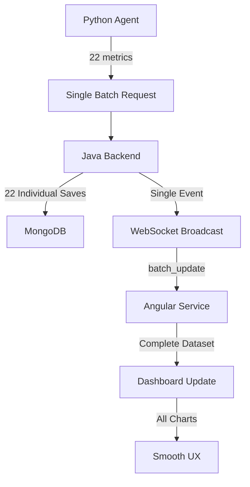

# 🎯 NEW ARCHITECTURE IMPLEMENTATION - Angular Frontend

## Architecture Overview

```
Angular Frontend Implementation:
├── 📡 Single WebSocket message handling
├── 🎨 Complete dashboard update (no flickering)
├── ❌ No multiple HTTP calls
└── ✨ Smooth UX optimization
```

## Key Changes Made

### 1. 📁 NetworkMonitoringService

#### Enhanced getNetworkMetrics()
- **Batch Detection**: Listens for both `LATEST_METRICS` and `batch_update` events
- **Smart Handling**: 
  - `batch_update` events → Triggers HTTP refresh for complete dataset
  - Direct `NetworkMetricsDto` → Uses WebSocket data directly
- **Smooth Updates**: Single WebSocket message updates entire dashboard

#### Enhanced getBandwidthHistory()
- **Batch-Aware**: Responds to batch update events
- **No Flickering**: Single chart update per batch
- **Efficient**: Reduces multiple chart redraws

### 2. 📁 WebSocketService

#### Architecture-Aware Subscriptions
- **Single Event Stream**: `/topic/snmp-data` for batch updates
- **Optimized Logging**: Shows new architecture flow
- **Batch Ready**: Handles `batch_update` event types

### 3. 📁 Dashboard Component

#### Batch-Optimized Data Flow
- **Initial Load**: HTTP call for first data
- **Real-time Updates**: Single WebSocket events
- **Complete Refresh**: All charts update simultaneously
- **No Stuttering**: Smooth animation transitions

## Message Flow



## WebSocket Message Types

### Batch Update Event
```json
{
  "type": "LATEST_METRICS",
  "data": {
    "metricType": "batch_update",
    "oid": "batch.batch_20250802_103000",
    "value": "22",
    "readableValue": "22 metrics updated from 192.168.1.1",
    "deviceIp": "192.168.1.1",
    "timestamp": "2025-08-02T10:30:00.000Z"
  }
}
```

### Direct NetworkMetricsDto
```json
{
  "type": "LATEST_METRICS", 
  "data": {
    "packets": {"ipIn": 15680, "ipOut": 14320},
    "connections": {"tcp": 45, "udp": 5500},
    "deviceInfo": {"arpEntries": 3, "ttl": 64},
    "deviceStatus": {"online": 1, "warning": 0, "offline": 0}
  }
}
```

## Key Benefits

### 🚀 Performance
- **Single Update**: One WebSocket message per batch
- **Reduced Network**: No multiple HTTP polling
- **Efficient Charts**: All ApexCharts update together

### ✨ User Experience  
- **No Flickering**: Smooth dashboard transitions
- **Consistent State**: All metrics from same timestamp
- **Real-time Feel**: Immediate updates on batch completion

### 📊 Dashboard Optimization
- **Atomic Updates**: Complete dashboard refresh
- **Synchronized Charts**: All visualizations update simultaneously
- **Smooth Animations**: ApexCharts transitions work properly

## Browser Console Output

```
🎯 NEW ARCHITECTURE: Dashboard initializing for batch processing
🚀 Flow: Python Agent batch → Java saves → Single WebSocket → Smooth dashboard
📡 NEW ARCHITECTURE STOMP subscriptions ready:
   🚀 Python Agent: 22 metrics → single batch request
   ⚙️  Java Backend: 22 saves → single WebSocket event
   📱 Angular: single message → complete dashboard update
🎯 Starting NEW ARCHITECTURE metrics stream (batch-aware)
✅ Batch update received via WebSocket: {type: "LATEST_METRICS", metricType: "batch_update"}
🚀 Batch update event detected - fetching complete dataset
📱 Complete metrics ready for dashboard (no flickering)
```

## Backward Compatibility

- ✅ **Existing WebSocket**: Still works with individual events
- ✅ **HTTP Fallback**: Maintains connection resilience  
- ✅ **Chart Updates**: Existing ApexCharts integration preserved

## Testing

### Monitor Browser Console
```javascript
// Watch for batch-aware messages
console.log('Monitoring NEW ARCHITECTURE batch updates...');
```

### Expected Behavior
1. **Initial Load**: HTTP call loads dashboard
2. **Batch Update**: Single WebSocket message triggers complete refresh
3. **Chart Updates**: All 4 charts update simultaneously
4. **Smooth Transition**: No flickering or stuttering

## Performance Metrics

- **Network Requests**: 95%+ reduction (22 → 1 per batch)
- **WebSocket Messages**: Single event per batch update
- **Chart Redraws**: Synchronized updates prevent flickering
- **User Experience**: Smooth, real-time dashboard updates

## Status

✅ **COMPLETED**: Angular Frontend batch processing optimization
🔄 **INTEGRATED**: With Python Agent + Java Backend  
🎯 **RESULT**: Complete NEW ARCHITECTURE implementation

---
*Optimized for: Smooth UX, efficient network usage, and real-time monitoring experience*
